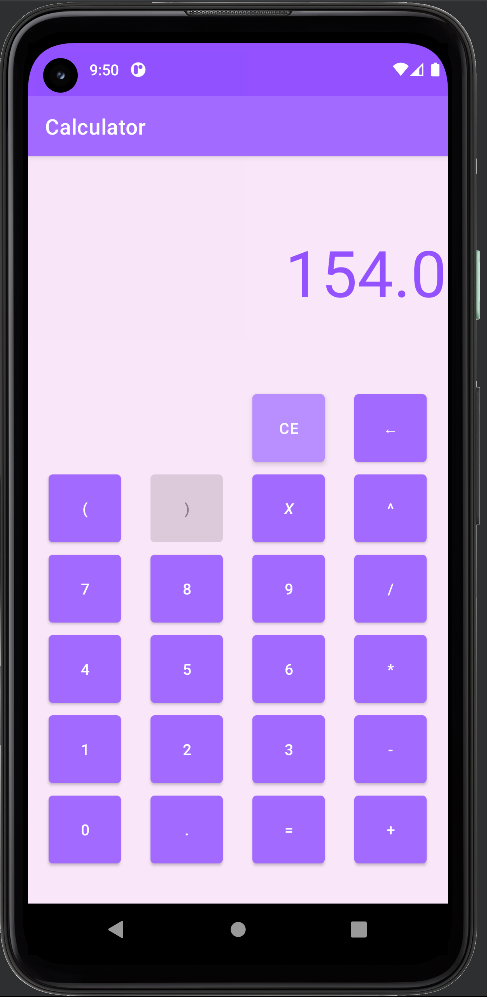
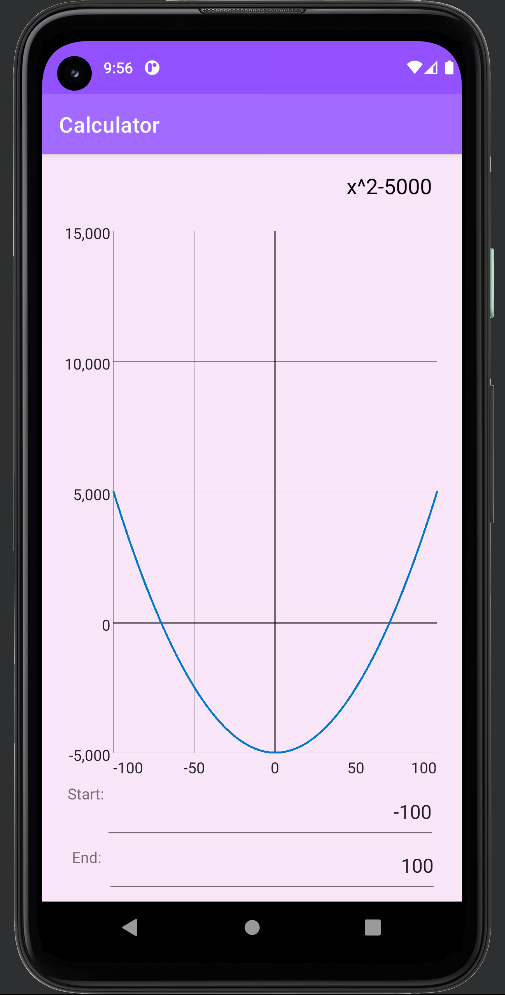

### Nota alla lettura da PDF
Il documento è stato scritto in formato Markdown. Per una migliore versione di questo file è consigliabile consultarne un copia in formato web a [questo link](https://github.com/BlackHole00/PublicDocs/blob/main/Viciguerra%20Francesco%20-%20Calcolatrice.md).

# Consegna
Creare un'applicazione android che consenta di:
- Risolvere un'espressione matematica con operazioni elementari e parentesi.
- Mostrare lo studio di una funzione con l'incognita.
Ulteriori punti da considerare:
- Utilizzare il minimo ammontare di codice esterno e di librerie aggiuntive

# Ipotesi
Durante la creazione del progetto sono stati ipotizzatati i seguenti punti:
- l'espressione analizzata deve essere matematicamente valida. Le seguenti espressioni, che possono essere considerate casi limite. devono essere gestibili e calcolabili senza errori:
	- mancanza dell'operatore di moltiplicazione:
		- `8(3 + 2)`
		- `(2 + 3)(3 + 2)`
		- `8x`
		- `(3 + 2)x2`
	- casi particolari di precedenza:
		- `-3^2`, _risultato: -9_
		- `(-3)^2`, _risultato: 9_
		- `-x^2`, _valutato come: -(x^2)_
		- `(-x)^2`
- l'espressione analizzata è un'espressione matematica standard, quindi è fornita con al massimo tre livelli di parentesi, supportando i tipi _graffa_, _quadra_ e _tonda_. Vengono successivamente elencati alcuni esempi di espressione con le parentesi:
	- `{[12 + 2][3 + (2 * 4)]}`
	- `{[(3 * 4) ^ 2] - 2}`
- lo studio della funzione con l'incognita avviene attraverso la visualizzazione sul grafico della funzione che permette quindi di mostrare il dominio della funzione. L'utente ha il controllo anche sull'intervallo che vuole visualizzare.
- L'applicazione deve essere in grado di riconoscere divisioni per zero (quindi sia _impossibili_ che _indeterminate_) e fornire un adeguato messaggio d'errore.
- Per motivi legati alla logica computazionale dei computer alcune operazioni possono causare un overflow nella computazione (ovvero l'ottenimento di un numero double con valore _infinity_). L'applicazione deve tenere conto di questo e fornire adeguati messaggi d'errore.

# Tecnologie utilizzate
## Android studio
Android studio è l'IDE utilizzato per l'applicazione, la quale è nativa Android. La tecnologia android si basa prevalentemente sull'utilizzo di:
- file di configurazione XML: per descrivere l'applicazione e crearne l'interfaccia in modo statico
- codice Java: per creare la logica e dare funzionalità all'applicativo.

La spiegazione nel preciso dell'intero funzionamento della programmazione Android è oltre lo scopo di questo documento. Verranno spiegate, qualora opportuno, specifici funzionamenti aggiuntivi e necessari.

## Kotlin
Kotlin è un linguaggio nuovo che sta prendendo piede negli ultimi anni. E'retrocompatibile con codice Java precedentemente scritto, in quanto non è solo in grado di interfacciarsi con esso, ma Kotlin può anche essere compilato direttamente in bytecode JVM.
Grazie a queste caratteristiche, il linguaggio sta quindi lentamente sostituendo Java ed è già il linguaggio ufficialmente raccomandato per la creazione di nuove applicazioni Android.

Dal punto di vista delle features Kotlin fornisce:
- una sintassi più moderna e flessibile
- i tipi primitivi come classi 
- null-safety
- migliori strutture per l'astrazione come:
	- `sealed classes`: migliori classi astratte
	- `getters, setters e properties`
	- `data class`: simile al `record` di Java 14
	- `objects e companion objects`: equivalente a `static`
	- `extensions`: la possibilità di aggiungere metodi a tipi o classi già precedentemente definite

Il motivo della scelta dell'utilizzo di Kotlin è puramente didattico, in quanto è stato voluto imparare un nuovo linguaggio.

Si nota tuttavia che in questo documento non verrà spiegato nel dettaglio il linguaggio. Verranno tuttavia rese note alcune features che non hanno un equivalente java qualora necessario alla comprensione del codice.

## GraphView
GraphView è una libreria Java per Android sviluppata da Jjoe64 ed è la più utilizzata per la creazione di schemi e grafici. 

Sebbene sia tecnicamente possibile implementare una propria versione utilizzando una view Android custom e sovrascrivendo il metodo virtuale `onDraw`, questa tecnica non è stata utilizzata perché la libreria è adeguatamente flessibile per le esigenze del progetto e la parte di analisi della funzione è di importanza secondaria.

E'stato comunque necessario imparare ad utilizzare la libreria, utilizzando la [documentazione ufficiale](https://github.com/jjoe64/GraphView/wiki/Documentation).

# Tecniche utilizzate
## Reverse Polish Notation
La reverse polish notation (abbreviazione RPM), anche detta _notazione postfissa_, è un metodo di rappresentazione di una espressione matematica che permette le rimozione delle parentesi ed è facilmente calcolabile da un computer.

La notazione normalmente utilizzata in matematica viene detta invece _notazione infissa_.
Quando nella notazione infissa l'operatore (quindi _più, meno, per, diviso_...) viene posto tra i due operandi, in quella postfissa, l'operatore viene posto questi ultimi.
> Per esempio _(infissa -> postfissa)_:
> - `3 + 2` -> `3 2 +`:
> 	Nella notazione postfissa, l'operatore _più_ fa riferimento agli ultimi due numeri, quindi 3 e 2
> - `3 + 2 * 4` -> `3 2 4 * +`:
> 	Nella notazione postfissa, l'operatore _per_ fa riferimento agli operatori 2 e 4, mentre l'operatore _più_, non potendo far più riferimento a 2 e 4, farà riferimento al risultato dell'operatore _per_ e a 3.

Come anche accennato in precedenza, la notazione postfissa rende possibile rimuovere le parentesi.
> Per esempio _(infissa -> postfissa)_:
> - `(3 + 2) * 4` -> `3 2 + 4 *`:
> 	Nella notazione postfissa, l'operatore _più_ fa riferimento a 3 e 2, mentre l'operatore _per_ fa riferimento al risultato dell'operazione _più_ e a 4.

La notazione polacca è facilmente calcolabile da un computer utilizzando una semplice struttura a stack, in quanto, diversamente dalla notazione infissa, le operazioni vengono eseguite a seconda del loro ordine nell'espressione, indipendentemente dalla normale priorità di queste ultime.

L'applicazione quindi dovrà convertire l'espressione infissa in postfissa per calcolare il risultato in modo semplice. Entrambi gli algoritmi verranno successivamente spiegati ed analizzati.

Si nota che la notazione polacca viene anche utilizzata nello studio della funzione.

# Struttura logica
L'applicazione è divisa in due parti fondamentali indipendenti le une dalle altre: un _frontend_ ed un _backend_.

## Frontend
Questa parte è dedicata all'interfaccia grafica e codice strettamente correlato con Android.

In Android ogni "schermata" con il quale l'utente può interagire viene detta _Activity_. Ogni activity può utilizzare un _intent_ per richiedere al sistema operativo di mostrare un nuova attività, la quale verrà logicamente piazzata "al di sopra" di quella corrente, in una modalità simile ad uno stack.
La terminazione dell'attività chiamata dall'intent (attraverso l'utilizzo del pulsante _indietro_ o attraverso il metodo `finish`) porterà alla riapparizione della precedente activity (quindi avviene effettivamente un "pop" dello stack delle activity).

### MainActivity
Questa activity è la principale e permette di inserire l'espressione utilizzando i pulsanti, che verranno disabilitati o abilitati a seconda dello stato dell'espressione attuale, per evitare che l'utente possa fare molti errori.

Come è possibile notare non sono presenti le parentesi graffe e quadre. Questo perché la parentesi nell'espressione sono automaticamente convertite nel corretto formato a seconda del numero di parentesi utilizzate dall'utente.

Dal punto di vista del codice, MainActivity contiene anche una funzione helper condivisa con tutti i listener, che, facendo riferimento a Kalculator, analizza l'espressione corrente ed abilita o disabilita i  pulsanti dell'interfaccia, come accennato in precedenza.


### GraphViewActivity
Questa activity mostra lo studio della funzione disegnando il grafico di quest'ultima. Viene chiamata dalla MainActivity a seguito della pressione del pulsante _uguale_ nel caso nell'espressione sia presente il simbolo _x_. 

L'utente può ulteriormente specificare l'intervallo di suo interesse ed il grafico verrà automaticamente aggiornato.



### Kalculator
Kalculator è un oggetto che fa da "colla" tra il frontend ed il backend. Si occupa di salvare l'espressione attuale sotto forma di stringa, di controllare gli operatori inseriti, di definire quali segni o valori possano essere inseriti al momento attuale, di gestire gli errori dell'utente e di eventuali espressioni errate e di offrire un risultato, sotto forma di numero, stampato al posto dell'espressione, o sotto forma di grafico, utilizzando la GraphViewActivity.

```kotlin
object Kalculator {  
    var expression = ""  
        private set  
  
    val isExpression: Boolean  
        get() = !expression.contains('x')  
  
    fun pushCharacter(char: Char) { ... }  
    fun canPushCharacter(char: Char): Boolean { ... }  
    fun clearAll() { ... }  
    fun deleteCharacter(): Char? { ... }  
    fun canDeleteCharacter(): Boolean { ... }  
    fun evaluateExpression() { ... }  
    fun evaluateFunction(start: Double, end: Double, interval: Double):
        ArrayList<Pair<Double, Double>>? { ... }  
}
```

Si nota che le funzioni di quest'oggetto vengono chiamate dai vari listener custom implementati nell'interfaccia.

Il nome è un'unione di Calculator e Kotlin.

Gli algoritmi specifici di questa classe non vengono riportati in quanto triviali, ad eccezione di qualche caso limite.

### OnClickListeners
Queste classi sono derivate dalla classe android `OnClickListener` e specificano, attraverso l'override di una funzione virtuale, il comportamento dell'applicazione a seguito del click di un pulsante.

Si nota che è necessario associare un listener ad un determinato pulsante per fare in modo che questo funzioni. Per far ciò viene utilizzato `findViewById`, per ottenere il riferimento al bottone desiderato, e `setOnClickListener` per associare un listener, come nel seguente esempio:
```kotlin
findViewById<Button>(R.id.btnNum0).setOnClickListener(CalculatorOnClickListener(this))
```

Si nota che nel GraphViewActivity è stato anche utilizzato il callback `OnTextChanged` in modalità inline con una lambda. Il codice completo non viene riportato perché di scarsa rilevanza, ma viene mostrato un semplice esempio.
```kotlin
findViewById<EditText>(R.id.txbStartValue).doOnTextChanged { text, _, _, _ ->  
    ...
}
```

Segue la lista degli OnClickListener presenti nel progetto. Si nota che questi ultimi sono simili gli uni agli altri, quindi solo uno di essi verrà mostrato nella sua interità. 

#### CalculatorOnClickListener
Questo listener viene utilizzato per la maggior parte dei pulsanti della calcolatrice. Quando eseguito inserisce un carattere nella calcolatrice equivalente al primo carattere del testo del pulsante, per poi aggiornare il testo e aggiornare i pulsanti, per disabilitare quelli non più utilizzabili ed abilitare quelli adesso validi.
```kotlin
class CalculatorOnClickListener(private var activity: MainActivity) 
: View.OnClickListener {  
    override fun onClick(v: View) {  
        val sender = v as Button  
  
        Kalculator.pushCharacter(sender.text[0])  
  
        activity.findViewById<TextView>(R.id.lblResult).text = Kalculator.expression  
  
        activity.updateButtons()  
    }  
}
```

#### CEOnClickListener
Utilizzato per il pulsante di pulizia.
```kotlin
class CEOnClickListener(private var activity: MainActivity) : View.OnClickListener {  
    override fun onClick(v: View) { ... }  
}
```

#### DelOnClickListener
Utilizzato per la rimozione dell'ultimo carattere della stringa.
```kotlin
class DelOnClickListener(private var activity: MainActivity) : View.OnClickListener {  
    override fun onClick(v: View) { ... }  
}
```

#### EqualsOnClickListener
Utilizzato per il pulsante uguale.
```kotlin
class EqualsOnClickListener(private var activity: MainActivity) : View.OnClickListener {  
    override fun onClick(v: View) { ... }  
}
```

#### ParenthesisOnClickListener
Utilizzato per i pulsanti delle parentesi.
```kotlin
class ParenthesisOnClickListener(  
    private var activity: MainActivity,  
    private val opening: Boolean,  
) : View.OnClickListener {  
    override fun onClick(v: View) { ... }  
}
```

## Backend
Il backend è la parte di software strettamente dedicata alla logica interna dell'applicazione. 

Fornisce quindi classi per la conversione di un'eventuale espressione nella corrispondente notazione polacca e per il calcolo di quest'ultima, supportando anche la sostituzione dell'incognita.
Inoltre il backend fornisce varie classi ed estensioni di supporto che vengono utilizzate anche nel frontend.

Segue un esempio di capacità del backend, utilizzando le classi che verranno esposte in seguito.
```kotlin
// Esempio senza incognita
val tokens = ExpressionTokenizer("3 + 2 * 4").tokenize()  
val parsedTokens = ExpressionParser(tokens).parse()  
result = ExpressionResolver(parsedTokens).resolve()
// result = 11

// Esempio con incognita
val tokens = ExpressionTokenizer("2x + 3").tokenize()  
val parsedTokens = ExpressionParser(tokens).parse()  
result = ExpressionResolver(parsedTokens).resolve(6) // x = 7
// result = 15
```

### ExpressionToken
ExpressionToken è un costrutto utilizzato nel codebase per identificare un singolo elemento dell'espressione, senza dover quindi lavorare con una stringa per la trasformazione di quest'ultima in notazione polacca e per la sua computazione.

Un ExpressionToken può assumere quindi i seguenti valori:
- _OperatorePiù_
- _OperatoreMeno_
- _OperatorePer_
- _OperatoreDiviso_
- _OperatorePotenza_
- _ParentesiAperta_
- _ParentesiChiusa_
- _Variabile X_, contenente il segno di quest'ultima e la modalità di computazione per casi particolari
- _Numero_, contenente il numero stesso e la modalità di computazione per casi particolari

In pratica la stringa di testo verrà convertita in una lista di token, come nel seguente esempio:
> `(2 + 3) * 4` -> `OpenParenthesis Value(2, None) OperatorPlus Value(3, None) CloseParenthesis OperatorMultiplication Value(4, None)`

Tale lista di token verrà poi convertita nella sua variante in notazione polacca per poi essere calcolata. In riferimento all'esempio precedente, la lista di token in notazione postfissa diventa:
> `2 3 + 4 *` -> `Value(2, None) Value(3, None) OperatorPlus Value(4, None) OperatorMultiplication`

Questa classe, dal punto di vista dell'implementazione e della stretta definizione teorica è un cosiddetto [_Tipo di dato algebrico (algebraic data type)_](https://en.wikipedia.org/wiki/Algebraic_data_type). Un dato algebrico è una tipo composto che è formato dalla combinazione di più tipi diversi.
Logicamente, comparandolo con il linguaggio C, è possibile considerarlo come una variante di un enumerato che, oltre al valore dell'enum contiene anche ulteriori dati, a modo simile di un union. Si nota tuttavia che il linguaggio C (e CPP) non supporta direttamente questi tipi di dato. 
Per avere un semplice esempio è possibile vedere il linguaggio di programmazione rust, che implementa questi tipi [direttamente nei suoi enum](https://doc.rust-lang.org/book/ch06-01-defining-an-enum.html).

Segue l'esempio di un tipo di dato algebrico. Ogni variabile di tipo `IpAddr` potrà essere di tipo `V4` (e contenere 4 valori unsigned ad 8 bit), di tipo `V6` (contenendo una stringa) oppure di tipo `None` (non contenendo nulla).
```rust
enum IpAddr {
    None,
    V4(u8, u8, u8, u8),
    V6(String),
}
```

Kotlin di per se'non supporta direttamente i tipi di dati algebrici, ma è possibile, ed è anche l'alternativa consigliata, utilizzare una combinazione di `sealed class`, di `data class` e di `object`, sfruttando il polimorfismo, per da creare un funzionamento simile a quello desiderato.

L'ExpressionToken è quindi definito nel seguente metodo:
```kotlin
sealed class ExpressionToken {  
    object OperatorPlus: ExpressionToken()  
    object OperatorMinus: ExpressionToken()  
    object OperatorMultiplication: ExpressionToken()  
    object OperatorDivision: ExpressionToken()  
    object OperatorPower: ExpressionToken()  
    object OpenParenthesis: ExpressionToken()  
    object CloseParenthesis: ExpressionToken()  
    data class VariableX(
	    val negative: Boolean, 
	    val nComp: NegativeComputationType = NegativeComputationType.None
	): ExpressionToken()  
    data class Value(
	    val value: Double, 
	    val nComp: NegativeComputationType = NegativeComputationType.None
    ): ExpressionToken()  
}
```

Si nota che in kotlin una `sealed class` è una speciale classe astratta che non permette l'aggiunta di nuovi metodi nelle sue classi derivate. In questo caso viene creata una classe sealed senza metodi, dalla quale derivano tutte le varianti dell'ExpressionToken.
Un `object` è l'equivalente delle classi statiche di java. In questo caso non ha senso creare più istanze di un token senza valori salvati all'interno di esso.
Infine una `data class` è simile al `record` di Java 14, ma causa anche il trattamento della classe come se fosse una struttura, quindi come se quest'ultima venisse sempre passata come valore.

#### NegativeComputationType
Questo enum è un tipo di supporto all'ExpressionToken e indica la modalità di computazione nel caso un valore negativo venga elevato.

Si consideri l'espressione `-3^2`. Normalmente quest'ultima dovrebbe venir convertita nei token `Value(-3, None) OperatorPower Value(2, None)`, per poi essere calcolata nel valore 9, dato dall'elevazione dal quadrato nel numero -3. Questo risultato non è tuttavia corretto, in quanto l'operatore potenza dovrebbe avere precedenza sul meno del numero elevato.

Una semplice soluzione può sembrare negare il risultato ottenuto se la base è negativa. Questo porta tuttavia ulteriori problemi nel caso dell'espressione `(-3)^2`, che perderà le sue parentesi durante il processo della conversione in notazione postfissa.

E'necessario allora salvare la modalità di calcolo nel caso di un'elevazione. Quest'ultima è definita utilizzando il seguente enumerato, in combinazione con l'ExpressionToken.

```kotlin
enum class NegativeComputationType {  
    PostNegate,  
    None,  
}
```

I casi d'esempio precedenti vengono quindi modificati in:
- `-3^2` -> `Value(-3, PostNegate) OperatorPower Value(2, None)`
- `(-3)^2` -> `Value(-3, None) OperatorPower Value(2, None)`, _nota: le parentesi sono state rimosse a scopo esemplificativo_

Entrambe adesso daranno i giusti risultati _(-9 e 9)_.

Si nota che la stessa modifica è stata apportata anche al token _VariableX_, che deve prevedere i casi `-x^2` e `(-x)^2`.

### ExpressionTokenizer
L'ExpressionTokenizer è una classe che permette di convertire un'espressione sotto forma di stringa nella sua corrispondente sequenza di token in modalità sempre infissa.
```kotlin
class ExpressionTokenizer(private val expression: String) {  
    fun tokenize(): ArrayList<ExpressionToken> { ... }
}
```

Si nota che il tokenizer è anche utilizzato per aggiungere eventuali token che l'utente ha tralasciato, ma che sono necessari per la valutazione corretta di una certa espressione, come dimostrato nei seguenti esempi:
- `3x` -> `Value(3, None) OperatorMultiplication VariableX(false, None)`
- `3(6 - 2)` -> `Value(3, None) OperatorMultiplication OpenParenthesis Value(6, None) OperatorMinus Value(2, None) CloseParenthesis`

Il funzionamento di questa classe è al quanto triviale e non contiene codice rilevante, se non per alcuni casi limiti, quindi non viene spiegato in questo documento. Se si desidera è comunque possibile leggere il file sorgente.

### ExpressionParser
L'ExpressionParser è una classe che permette di convertire una lista di token nell'equivalente forma postfissa. In questo passaggio non vengono creati nuovi token, ma vengono solo spostati o rimossi (nel caso delle parentesi) quelli esistenti.

Segue il codice della classe e la spiegazione dell'algoritmo di conversione.
```kotlin
class ExpressionParser(private val tokens: ArrayList<ExpressionToken>) {  
    private fun operatorImportance(token: ExpressionToken): Int {  
        return when (token) {  
            is ExpressionToken.OperatorPlus, is ExpressionToken.OperatorMinus -> 1  
            is ExpressionToken.OperatorMultiplication, 
	            is ExpressionToken.OperatorDivision -> 2  
            is ExpressionToken.OperatorPower -> 3  
            else -> 0  
        }  
    }  
  
    fun parse(): ArrayList<ExpressionToken> {  
        val result = ArrayList<ExpressionToken>()  
        val stack = Stack<ExpressionToken>()  
  
        for (token in tokens) {  
            // 001:
            if (token is ExpressionToken.Value || 
	            token is ExpressionToken.VariableX
            ) {  
                result.add(token)
                continue  
            }  

            // 002:  
            if (token is ExpressionToken.OpenParenthesis) {  
                stack.addLast(token)
                continue  
            }  

			// 003:
            if (token is ExpressionToken.CloseParenthesis) {  
                while (stack.last() !is ExpressionToken.OpenParenthesis) {  
                    result.add(stack.removeLast())  
                }  

                stack.removeLast()  
  
                continue  
            }  

            // 004:
            while (stack.isNotEmpty() &&  
                stack.last() !is ExpressionToken.OpenParenthesis &&  
                operatorImportance(stack.last()) >= operatorImportance(token)  
            ) {  
                result.add(stack.removeLast())  
            }  
            stack.addLast(token)  
        }  

		// 005:
        while (stack.isNotEmpty()) {  
            result.add(stack.removeLast())  
        }  
  
        return result  
    }  
}
```
L'algoritmo si basa sull'utilizzo di una classe stack, in combinazione con una funzione helper che definisce l'importanza/precedenza degli operatori (in questo caso `operatorImportance`). Lo stack viene utilizzato come storage temporaneo per i segni che vanno spostati.

Si consideri _result_ la lista di output.
Per ogni token iterato nella lista di input, se quest'ultimo è un numero o una variabile X, esso viene aggiunto a result _(001)_.
Se invece si tratta di una parentesi aperta, quest'ultima verrà posta nello stack _(002)_.
Ulteriormente se viene tratta in considerazione una parentesi chiusa, verranno posti in result tutti gli operatori presenti nello stack, fino alla prima parentesi aperta, sempre presenta in esso _(003)_.
Nell'ulteriore caso che il token sia un operatore, verranno posti in result tutti gli operatori nello stack fino al primo con minore importanza, per poi inserire l'operatore analizzato nello stack. Questa parte è quella che permette il giusto cambio di precedenza degli operatori _(004)_.
Infine, ogni singolo token rimasto nello stack viene posto nel result _(005)_.

> Si riporta l'ulteriore esempio della conversione dell'espressione `3 * 2 + 4`, che deve diventare `3 2 * 4 +`
> - Token _Value(3, None)_:
> 	- stack:
> 	- result: _Value(3, None)_
> - Token _OperatorMultiplication_:
> 	- stack: _OperatorMultiplication_
> 	- result: _Value(3, None)_
> - Token _Value(2, None)_
> 	- stack: _OperatorMultiplication_
> 	- result: _Value(3, None), Value(2, None)_
> - Token _OperatorPlus_
> 	- stack: _OperatorPlus_
> 	- result: _Value(3, None), Value(2, None), OperatorMultiplication_
> - Token _Value(4, None)_
> 	- stack: _OperatorPlus_
> 	- result: _Value(3, None), Value(2, None), OperatorMultiplication, Value(4, None)_
> - Result: _Value(3, None), Value(2, None), OperatorMultiplication, Value(4, None), OperatorPlus_

### ExpressionResolver
Questa classe ha il compito di, data un'espressione in notazione polacca, computarne il risultato. Questa classe permette anche di calcolare una funzione per un determinato valore di X fornito in input.

Segue il codice della classe e la spiegazione dell'algoritmo di conversione.
```kotlin
class ExpressionResolver(private val parsedTokens: ArrayList<ExpressionToken>) {  
    fun resolve(xValue: Double? = null): Double {  
        val tokens = ArrayList(parsedTokens)  

		// 001
        if (xValue == null && 
            parsedTokens.find { t -> t is ExpressionToken.VariableX } != null
        ) {  
            throw IllegalStateException()  
        }  
        if (xValue != null) {  
            tokens.replaceAll { t ->  
                if (t is ExpressionToken.VariableX) {  
                    if (t.negative) {  
                        ExpressionToken.Value(-xValue, t.nComp)  
                    } else {  
                        ExpressionToken.Value(xValue, NegativeComputationType.None)  
                    }  
                } else {  
                    t  
                }  
            }  
        }  
  
        val stack = Stack<ExpressionToken.Value>()  
  
        for (token in tokens) {  
	        // 002
            if (token is ExpressionToken.Value) {  
                stack.addLast(token)  
  
                continue  
            }  
  
            val second = stack.removeLast()  
            val first = stack.removeLast()  

			// 003
            when (token) {  
                is ExpressionToken.OperatorPlus -> {  
                    stack.addLast(ExpressionToken.Value(first.value + second.value))  
                }  
                is ExpressionToken.OperatorMinus -> {  
                    stack.addLast(ExpressionToken.Value(first.value - second.value))  
                }  
                is ExpressionToken.OperatorMultiplication -> {  
                    stack.addLast(ExpressionToken.Value(first.value * second.value))  
                }  
                is ExpressionToken.OperatorDivision -> {  
	                // 004
                    if (second.value == 0.0) {  
                        if (first.value == 0.0) {  
                            throw UndefinedDivisionException()  
                        }  
                        throw DivisionByZeroException()  
                    }  
  
                    stack.addLast(ExpressionToken.Value(first.value / second.value))  
                }  
                is ExpressionToken.OperatorPower -> {  
                    var actualFirst = first.value  
  
                    var res = actualFirst.pow(second.value)  

					// 005
                    if (first.nComp == NegativeComputationType.PostNegate) {  
                        res = -abs(res)  
                    }  
  
                    stack.addLast(ExpressionToken.Value(res))  
                }  
                else -> {}  
            }  

			// 006
            if (stack.last().value.isInfinite()) {  
                throw OverflowCalculationException()  
            }  
            if (stack.last().value.isNaN()) {  
                throw OverflowCalculationException()  
            }  
        }  

        if (stack.size > 1) {  
            throw IllegalStateException()  
        }  

		// 007
        return stack.removeLast().value  
    }  
}
```

Come l'algoritmo di conversione, anche quello di risoluzione utilizza uno stack, ma questa volta per il salvataggio dei valori calcolati.

Prima di eseguire il calcolo, vengono sostituite tutte le occorrenze del token _VariableX_ nell'espressione con il valore specificato in input, facendo attenzione ad utilizzare la giusta modalità di computazione _(001)_.
Per ogni token quindi, se è un valore, viene posto nello stack _(002)_, mentre se è un'operazione quest'ultima verrà risolta prendendo i primi due valori dello stack ed utilizzandoli come operatori dell'operazione che si desidera calcolare. Il risultato viene rimesso nello stack _(003)_.
Vengono fatti alcuni ulteriori controlli nel caso della divisione (che può essere impossibile o indeterminata) _(004)_, nel caso della potenza (dove bisogna seguire le regole di eccezione elencate prima) _(005)_ o nel caso di overflow _(006)_.
Alla fine dell'algoritmo, l'ultimo valore rimasto nello stack è il risultato dell'espressione e viene ritornato _(007)_.

> Si riporta l'esempio correlato all'espressione in notazione postfissa `3 2 * 4 +`:
> - Token _Value(3, None)_:
> 	- Stack: _Value(3, None)_
> - Token _Value(2, None)_:
> 	- Stack: _Value(3, None), Value(2, None)_
> - Token _OperatorMultiplication_
> 	- Stack: _Value(6, None)_
> - Token _Value(4, None)_:
> 	- Stack: _Value(6, None), Value(4, None)_
> - Token _OperatorPlus_:
> 	- Stack: _Value(10, None)_
> - Risultato: 10

### ExpressionHelper e CharExtensions
L'oggetto ExpressionHelper e le estensioni al tipo Char sono aggiunte di utility utilizzate sia dal backend che dal frontend.

ExpressionHelper fornisce un metodo per correggere le parentesi di una espressione. Quindi trasformerà un'espressione che utilizza solo parentesi tonde con una che utilizza sia quadre che graffe.
```kotlin
object ExpressionHelper {  
    fun getCorrectParenthesisExpression(str: String): String { ... }  
}
```

Le estensioni al tipo Char forniscono metodi per facilmente definire se il carattere appartiene alla calcolatrice e che ruolo ha in essa.
```kotlin
fun Char.isOpeningParenthesis(): Boolean { ... }  
fun Char.isClosingParenthesis(): Boolean { ... }  
fun Char.isParenthesis(): Boolean { ... }  
fun Char.isValidCalculatorCharacter(): Boolean { ... }  
fun Char.isCalculatorOperator(): Boolean { ... }  
fun Char.isCalculatorSign(): Boolean { ... }
```

Entrambe hanno algoritmi triviali, che sono stati omessi da questo documento.

## Stack
Per puro scopo didattico non è stata utilizzata nessuna classe stack già implementata, bensì ne è stata implementata una custom utilizzando una lista linkata.

Il codice inerente all'implementazione dello stack non viene riportato nella sua forma completa in quanto non è strettamente inerente col progetto.

```kotlin
class Stack<T> {  
    private class StackCell<T>(val value: T) {  
        var next: StackCell<T>? = null  
        var prev: StackCell<T>? = null  
    }  
  
    private var first: StackCell<T>? = null  
    private var last: StackCell<T>? = null  
  
    var size: Int = 0  
        private set  
  
    fun removeLast(): T { ... }  
    fun addLast(value: T) { ... }  
    fun last(): T { ... }  
    fun isEmpty(): Boolean = ...
    fun isNotEmpty(): Boolean = ...
}
```

# Possibili miglioramenti
La struttura dell'applicazione è decisamente solida, ma alcuni miglioramenti possono comunque essere applicati nel caso si voglia continuare a lavorare nel progetto.

In primo luogo sarebbe molto utile la divisione della classe ExpressionTokenizer, spostando la parte di aggiunta di token extra in una nuova classe ExpressionPreProcessor, che lavorerebbe sulla lista di token generata dal tokenizer. Questo migliorerebbe sia la struttura che l'espandibilità del progetto.

Successivamente la gestione degli errori potrebbe essere migliorabile. Seguendo la pura preferenza personale, sarebbe utile diminuire il numero di errori risultanti da eccezioni, effettuando una migliore gestione di queste ultime ed utilizzando con più efficacia i valori opzionali. Personalmente il metodo della gestione degli errori attraverso le eccezioni non è il mio preferito e preferirei farne a meno totalmente (sostituendole con valori opzionali e, se si stesse utilizzando un altro linguaggio, valori multipli ritornati), ma sia in Java che in Kotlin queste ultime sono costrutto fondamentale e non eliminabile o rimpiazzabile.

# Conclusioni
E'stata creata una calcolatrice android che è in grado di calcolare semplici espressioni matematiche dando la gusta precedenza agli operatori ed alle parentesi. Per far ciò è stata utilizzato un sistema con architettura divisa tra frontend (per interfacciarsi con l'interfaccia android e l'utente) e backend (fornendo strutture e servizi per eseguire il calcolo dell'espressione) ed è stata utilizzata la notazione polacca postfissa.

L'applicazione è anche in grado, qualora sia presente una variabile X nell'espressione, di visualizzarne il dominio.